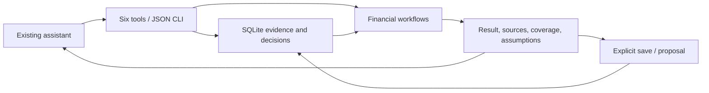

# Architecture

Wealth is a local financial capability for an existing assistant. The assistant
understands the request and explains the choice. Deterministic code owns the
records, arithmetic, dates, and decision state.

## Small public surface

`context`, `remember`, `run`, `recall`, `decision`, `client` are the public
operations. [The task catalog](wealth/catalog.py) documents calculation inputs.
MCP and CLI share [one service boundary](wealth/service.py).

## Responsibilities

- `store.py`: client-scoped facts, correction history, atomic revisions,
  idempotent writes, proposal lifecycle, export/delete, derived-state cursors.
- `recall.py`: bounded lexical/concept retrieval; optional host-supplied vectors.
- `household.py`: canonical import, reconciliation, ownership, liquidity,
  look-through, overlap, FX, and uncertain exposure ranges.
- `market.py`: historical analysis, stress, comparison, constrained construction,
  dated walk-forward validation, and factors over the retained `legacy.py` engine.
- `research.py`: source-led company/fund cases, household links, case changes,
  DCF and multiples scenarios; optional public-data adapters.
- `workflows.py`, `planning.py`: protected capital, cash calendars, simulations,
  income comparisons, liability matching with arrears.
- `tax.py`: scoped US federal and Mexican Article 129 lot scenarios.
- `monitor.py`: opt-in checks and change events; the host or foreground CLI polls.

Financial modules return `status`, `result`, `missing`, `warnings`, `sources`,
and `assumptions`. They do not write memory. The service records consulted
memory evidence and its revision; saving is explicit and uses that revision.
Concurrent corrections therefore cannot silently overwrite a saved report.

## Invariants

Unknown is not zero. Currency conversion requires supplied or provider-derived
FX. Inferred or expired memory cannot drive calculations. An incomplete
household cannot support a definitive whole-household allocation conclusion.
An optimizer is compared with an equally scoped baseline. Historical beliefs
must be dated before use in Black–Litterman validation. Dividends are part of
total return. Unpaid liabilities consume later cash before it is uncommitted.

A proposal records reasoning against evidence. Acceptance records a person's
choice; it executes no order. Changed or expired evidence forces review.
Derived retrieval indexes and monitor cursors do not change financial revisions.

SQLite is local plaintext and assumes a trusted operating-system account.
There is no hosted authorization layer, trading connection, or model runtime.
The old command launcher remains for compatibility; the packaged engine is the
single implementation. See [verification](docs/verification.md) for observed
results and [README](README.md) for installation.
