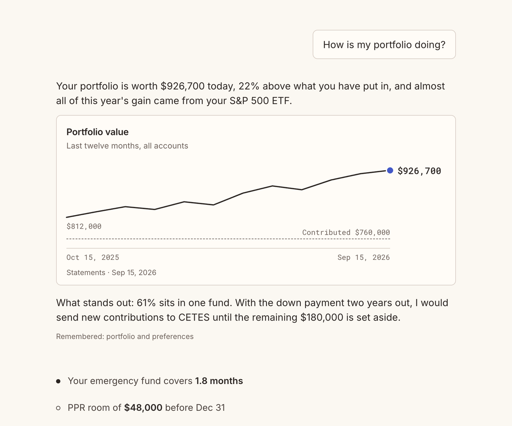
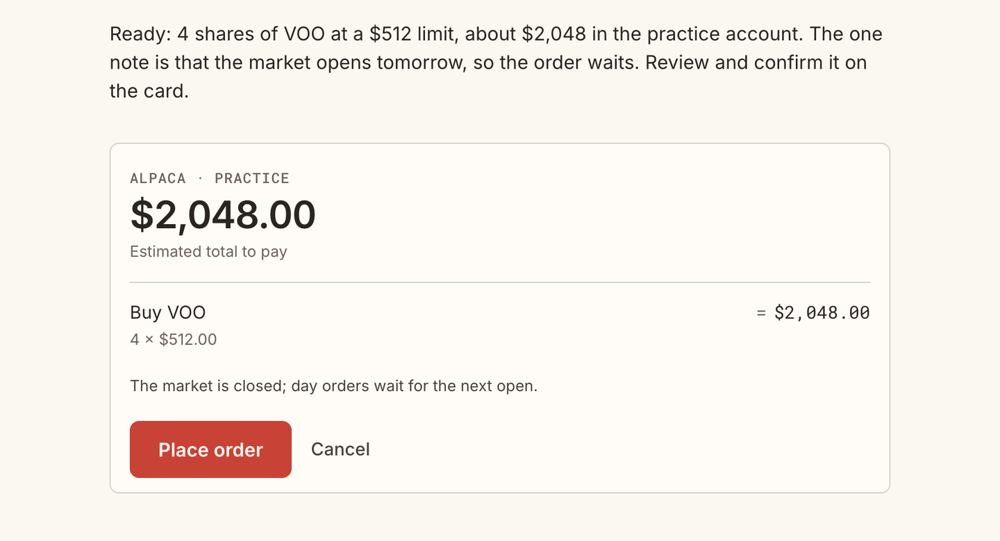
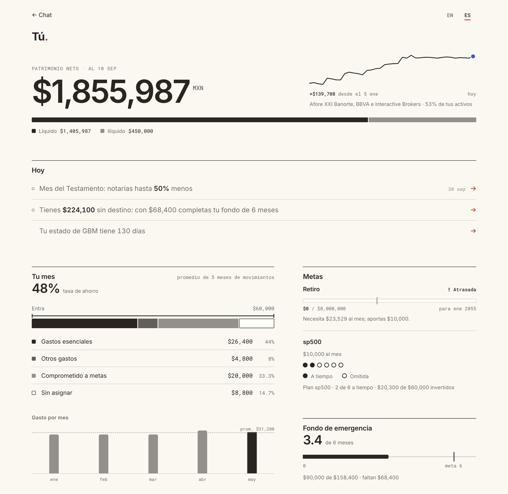

# Wealth

[](https://github.com/isaacentebi/wealth-harness/actions/workflows/check.yml)

**A private financial adviser for people in Mexico and the US that starts from
your whole financial life, not a portfolio: deterministic engines compute every
figure from your own statements, an AI explains what matters, and it reads your
broker and bank but places an order only when you tap to confirm.**

It answers in Mexican Spanish or English, with the products, taxes and
institutions of where you live: CETES and AFORE, Art. 129 and PPR, IRAs and wash
sales. It runs on your computer, and your data stays in a local SQLite file.

<p align="center">
  
  
</p>
<p align="center">
  
</p>

## Why it is different

- **Wealth-first.** It starts with income, spending, savings, debts, goals and
  retirement, and treats investing as one part of that picture.
- **Numbers come from code, not the model.** Fifty-three deterministic tasks
  (tax lots, Mexican real interest, IMSS pensions, rebalancing, 13F
  look-through) return each figure with its sources and assumptions. The model
  chooses what matters and says it plainly.
- **Statements are the source of truth.** Upload a PDF or CSV statement, or sync
  Interactive Brokers, Alpaca or Cuenca. Wealth reconciles it with what you told
  it, shows the differences and saves nothing until you say yes.
- **Read-write brokers, tap to confirm.** Connectors only read. The model can
  prepare an order ticket with pre-trade checks; only your tap on its card sends
  it, to Alpaca or to Interactive Brokers through the gateway you run. Paper
  trading is the default. For brokers without an API (GBM, Vest, Schwab,
  Fidelity) the card says exactly what to place, SIC or BMV included, and your
  next statement confirms it.
- **Memory you can see.** Every fact records where it came from and when it was
  last checked, and you can edit, confirm or delete it on the You page.

## Quick start

Needs Python 3.11+ and [uv](https://docs.astral.sh/uv/).

```sh
git clone https://github.com/isaacentebi/wealth-harness.git
cd wealth-harness
uv sync
```

### Plug into your agent (no model needed)

Wealth is also an MCP server with nine tools. Your host brings the model and
web search; Wealth brings the engines and the memory. Give the host
[SKILL.md](SKILL.md) as its instructions.

**Claude Code**, from the checkout:

```sh
claude mcp add wealth -e WEALTH_DB="$HOME/.local/share/wealth-harness/clients.sqlite3" \
  -- uv --directory "$PWD" run wealth-mcp
```

**Claude Desktop** (`~/Library/Application Support/Claude/claude_desktop_config.json`
on macOS); use absolute paths, and the full path to `uv` (`which uv`) if the app
cannot find it:

```json
{
  "mcpServers": {
    "wealth": {
      "command": "uv",
      "args": ["--directory", "/absolute/path/to/wealth-harness", "run", "wealth-mcp"],
      "env": {"WEALTH_DB": "/absolute/private/path/clients.sqlite3"}
    }
  }
}
```

Two optional `env` entries for either host:

- `"WEALTH_SEC_USER_AGENT": "Your Name you@example.com"` turns on the 13F manager
  tasks; the SEC asks every EDGAR caller for a contact, and it goes only to sec.gov.
- Saving a statement takes your one yes: its proposal carries a summary and a
  one-time `confirmation_code` for you, and the save sends the code back after
  your yes. Answering a contradiction or accepting a decision takes two calls:
  the first returns a summary and a code, the second completes it after your yes
  (codes are kept in the database for 10 minutes, so hosts that restart the
  server each turn still finish).
  `"WEALTH_HOST_HANDLES_CONSENT": "1"` drops the code for hosts whose own
  tool-approval prompt is your consent (Claude Code or Desktop asking before each
  `wealth_ingest`/`wealth_decision` call). The trade-off: the code proves the yes came
  from you after seeing the summary; with the flag, a model that calls the tool on
  its own (for example after reading instructions planted in a statement) is stopped
  only by that approval prompt, so leave it off if you auto-approve Wealth's tools.
  With `claude mcp add`, pass each as `-e NAME=value`.

**OpenClaw**, to talk to Wealth over WhatsApp, Telegram, iMessage or Signal:

```sh
integrations/openclaw/install.sh --dry-run   # shows every change, touches nothing
integrations/openclaw/install.sh
openclaw gateway restart
```

Details: [docs/openclaw.md](docs/openclaw.md).

### Local chat (Codex)

The browser chat and the You page use the Codex CLI signed in with your ChatGPT
account:

```sh
codex login
uv run wealth-chat --client me
```

Open **http://127.0.0.1:8765/**. Add `--demo` for a fictional profile instead of
your own. Models, depth, fresh test profiles and the terminal version:
[docs/agent.md](docs/agent.md).

The chat starts with your situation: a few one-question cards you can answer,
skip or replace with a statement upload, then a first synthesis of where you
stand. After that, ask anything; answers stream, can be stopped, and arrive with
charts and order cards drawn by the engine, not the model.

## What it can do

- **Money in and out:** spending, cash calendars, projections, debt payoff and
  a debt engine (amortization, prepay vs invest, refinancing, avalanche vs
  snowball), reserves and goals.
- **What you own:** a transaction ledger with lots, gains and income; returns,
  exposure and overlap.
- **Investing:** an investment policy, tax-aware rebalancing, asset location,
  recurring investing, portfolio construction, stress tests, company and fund
  research.
- **Tax:** US federal lots, wash sales and harvesting; Mexico Art. 129, real
  interest, deductions and PPR, foreign securities, the tax calendar; US estate
  exposure for non-residents; an annual tax pack for your contador or CPA
  (Form 8949 lots with wash sales, Art. 129 per broker against the constancia,
  FBAR/8938 flags) as JSON, CSV and a printable page.
- **Retirement:** IMSS Ley 73 and 97, AFORE and Modalidad 40; Social Security,
  contribution limits and withdrawal order.
- **Protection and guardrails:** insurance and estate gaps, an estate and
  beneficiary register (who receives each account at death and the gaps by
  amount at risk), life events, speculation, panic selling and scam checks.
- **Reviews:** what needs attention today, a weekly letter, a quarterly review,
  a fee audit.
- **Following managers:** SEC 13F holdings, profiles and comparisons, and a
  mirror sized within your policy.

Every task with its inputs and an example: [docs/cli.md](docs/cli.md#tasks).

## Boundaries

- **Connectors only read.** IBKR Flex, Alpaca and Cuenca are pulled when you
  ask, never in the background. A sync returns a proposal; nothing is saved
  until you say yes. Keys live in the OS keychain or environment variables,
  never in the database, logs or chat.
- **Only you place an order.** No tool, command or "yes" in chat places one.
  Orders go to Alpaca or IBKR (paper unless you opt in) or onto a card you
  place yourself.
  Live trading needs a server-side opt-in, a typed confirmation the first time
  and per-order and daily limits. Wealth never moves money or sends messages.
  Threat model: [docs/trading.md](docs/trading.md).
- **Not a licensed adviser.** Wealth gives analysis and decision support, sizes
  only as ranges from your own figures, and does not prepare returns or take
  filing positions. It refers you to a contador público or CPA for tax, an
  abogado, notario or attorney for legal matters, and CONDUSEF for disputes
  with Mexican financial institutions.
- **Privacy.** Your profile, ledger and decisions live in a local plaintext
  SQLite file. Statement uploads are deleted after they are saved (or after 30
  days), and ingestion masks account numbers and drops RFC, CURP and SSN. The
  model provider sees the conversation, a short summary of your situation each
  turn and the tool results the model reads. Each turn fetches prices for held
  symbols from Yahoo Finance (symbols only, no amounts or identity); `WEALTH_OFFLINE=1`
  turns that off. The local web page loads fonts from Google Fonts, which sees
  the IP and the font request but no financial data.

## Documentation

| Document | For |
| --- | --- |
| [docs/agent.md](docs/agent.md) | Running the chat and terminal assistant, fresh test profiles, runtime policy |
| [docs/cli.md](docs/cli.md) | Every task, CLI command and MCP tool, with an example; ingestion and connector setup |
| [docs/architecture.md](docs/architecture.md) | Module map, data flow, invariants and trust boundaries |
| [docs/trading.md](docs/trading.md) | Guarded order execution: checks, setup, threat model |
| [docs/openclaw.md](docs/openclaw.md) | Text-channel setup through OpenClaw |
| [docs/verification.md](docs/verification.md) | Checks, evaluations and what they establish |
| [docs/open-source.md](docs/open-source.md) | Dependencies and reuse |
| [SKILL.md](SKILL.md) | Condensed policy for an MCP host |
| [wealth/instructions.md](wealth/instructions.md) | The assistant's full conversation policy |
| [references/playbook.md](references/playbook.md) | Interpreting financial results |
| [CONTRIBUTING.md](CONTRIBUTING.md) | Setup, checks and the rules for changes |
| [SECURITY.md](SECURITY.md) | Reporting a vulnerability; what Wealth defends |

## Development

```sh
uv sync --extra dev
uv run pytest -q
uv run python -m examples.complete_journey
uv build
```
