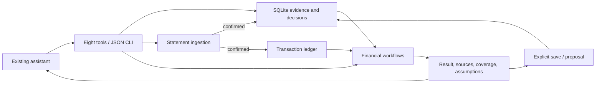

# Architecture

Wealth is a local financial capability for an existing assistant. The assistant
understands the request and explains the choice. Deterministic code owns the
records, arithmetic, dates, and decision state.

## Small public surface

Eight MCP tools: `wealth_context`, `wealth_remember`, `wealth_run`,
`wealth_recall`, `wealth_decision`, `wealth_ingest`, `wealth_inspect`,
`wealth_client`. The CLI exposes the same operations (`context`, `remember`,
`run`, `recall`, `decision`, `ingest`, `client`) plus the person-only `forget`
and the foreground `watch`. [The task catalog](../wealth/catalog.py) documents
every task's inputs with a runnable example. MCP and CLI share
[one service boundary](../wealth/service.py).

## Responsibilities

- `store.py`: client-scoped facts, correction history, atomic revisions,
  idempotent writes, proposal lifecycle, export/delete, derived-state cursors.
- `recall.py`: bounded lexical/concept retrieval; optional host-supplied vectors.
- `ingest/`: statement PDFs, CSV/XLSX exports, host-read image text, host LLM
  extraction (checked against the page text) and chat facts become one
  reconciled, redacted proposal. `service.ingest` holds proposals by id; only
  `confirm` saves one, and `ingest_posting.py` turns it into a ledger batch.
- `ledger/`: append-only, idempotent transaction ledger (store tables) with
  derived holdings, lots, realized gains, income, reconciliation against
  statement balances, household export and performance (TWR, XIRR).
  `cashflow.py` categorizes spending and derives the investable surplus;
  `dca.py` schedules, checks and backtests recurring-investment plans.
- `household.py`: canonical import, reconciliation, ownership, liquidity,
  look-through, overlap, FX, and uncertain exposure ranges.
- `market.py`: historical analysis, stress, comparison, constrained construction,
  dated walk-forward validation, factors, and SIC (`.MX`) pricing against the
  home market, over the retained `legacy.py` engine.
- `research.py`: source-led company/fund cases, household links, case changes,
  DCF and multiples scenarios; optional public-data adapters.
- `workflows.py`, `planning.py`: protected capital, cash calendars, simulations,
  income comparisons, liability matching with arrears.
- `tax.py`, `us_tax_parameters.py`: US federal lot, wash-sale and harvesting
  scenarios on dated 2025/2026 brackets; Mexican Article 129 sales.
- `mexico.py`: Mexico-resident holdings, real interest, deductions/PPR, foreign
  securities outside the SIC and the tax calendar, from a dated parameter table
  that fails closed on unverified values. `estate.py`: US estate exposure for
  non-residents.
- `monitor.py`: opt-in checks and change events; the host or foreground CLI polls.

Financial modules return `status`, `result`, `missing`, `warnings`, `sources`,
and `assumptions`. They do not write memory. The service records consulted
memory evidence and its revision; saving is explicit and uses that revision.
Concurrent corrections therefore cannot silently overwrite a saved report.

## Invariants

Unknown is not zero. Currency conversion requires supplied or provider-derived
FX. Inferred or expired memory cannot drive calculations. An incomplete
household cannot support a definitive whole-household allocation conclusion.
Research evidence alone does not establish personal suitability. Ownership
overlap and historical return correlation answer different questions.
An optimizer is compared with an equally scoped baseline. Historical beliefs
must be dated before use in Black–Litterman validation. Dividends are part of
total return. Unpaid liabilities consume later cash before it is uncommitted.

A proposal records reasoning against evidence. Acceptance records a person's
choice; it executes no order. Changed or expired evidence forces review.
Derived retrieval indexes and monitor cursors do not change financial revisions.

SQLite is local plaintext and assumes a trusted operating-system account.
There is no hosted authorization layer or trading connection. The optional
local model launcher is separate from the financial core.

## Local assistant

`agent.py` runs the installed Codex CLI with the shared `instructions.md` policy,
bounded conversation history, native web search and the Wealth MCP server.
`web.py` and `chat.html` add the local browser interface. SQLite retains facts;
the browser transcript is in process memory. `behavior.py` loads the shared
policy and provides the first-time welcome. [Agent setup](agent.md) covers
configuration and fresh test sessions.

`wealth/legacy.py` remains the packaged historical analytics engine.
`tools/wm.py` is its compatibility entrypoint; `tools/test_*.py` still exercises
that public compatibility surface. It is active code, not a duplicate to delete.
See [verification](verification.md) for checks and [README](../README.md) for setup.
