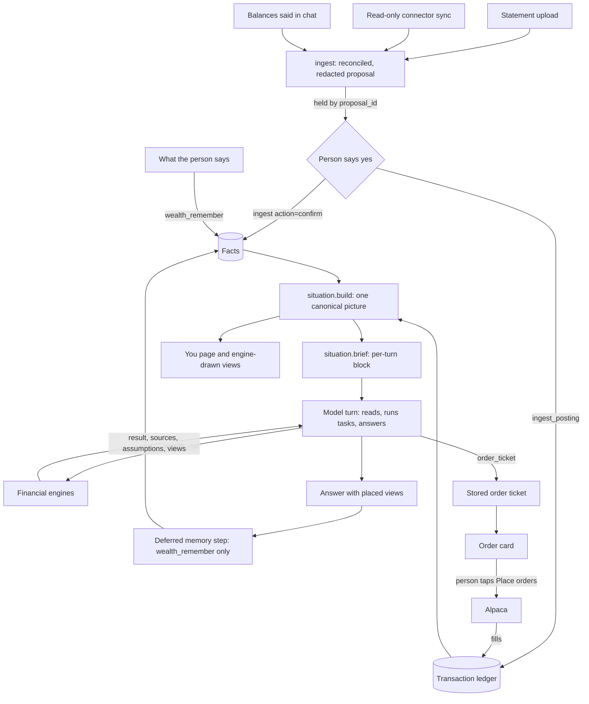

# Architecture

Wealth is a local financial adviser. Deterministic Python owns the records,
arithmetic, dates, decisions and every order; a language model reads the
person, chooses what matters and explains it. The same service sits behind the
browser chat, the JSON CLI and the MCP server.

## Data flow

1. **In.** A statement (PDF, CSV/XLSX, image text), a connector sync or a
   balance said in chat becomes one reconciled, redacted proposal, held
   server-side by `proposal_id`. Nothing is saved yet.
2. **Confirm.** Only `ingest action=confirm`, after the person's yes, saves the
   stored proposal: `account.*`, `liability.*` and `income.*` facts plus a
   ledger batch, in one transaction.
3. **Picture.** `situation.build(snapshot, ledger, today)` is the one reader of
   facts and ledger. Statements win over stated balances and the difference is
   kept.
4. **Brief.** `situation.brief` is the short block every turn starts with: net
   worth, monthly flow, commitments, reserve, debts, goals, open threads and
   unknowns.
5. **Turn.** The model (Codex locally, or any MCP host) reads the brief, calls
   tasks through `wealth_run` and answers. Engines return `status`, `result`,
   `missing`, `warnings`, `sources`, `assumptions` and up to two views.
6. **Deferred memory step.** In the browser chat the conversational turn cannot
   write facts. After the answer is shown, a separate low-effort Codex run with
   only `wealth_context`, `wealth_inspect` and `wealth_remember` records what
   the exchange established. The next turn waits for it. MCP hosts and the
   terminal agent save in-turn instead.
7. **Profile and views.** The You page (`/profile`) and views are drawn from the
   same picture and results, so what the conversation saved is what the page
   shows.

## Module map

Surfaces

| Module | Role |
| --- | --- |
| `service.py` | The one application boundary: `TASKS`, task routing, ingest actions, CLI operations |
| `server.py` | Stdio MCP server exposing nine tools over the service |
| `cli.py` | JSON CLI: one JSON object in, JSON out; `forget` needs an interactive terminal; `watch` |
| `cli_text.py` | Text-channel commands for hosts like OpenClaw: `onboarding`, `today`, `view` |
| `web.py`, `chat.html`, `profile.html`, `review.html`, `static/` | Loopback browser chat, the You page, the quarterly review, uploads, onboarding cards, order cards; each page is a markup shell whose CSS and JS are `static/<page>.css` and `static/<page>.js`, served by exact name |
| `agent.py` | Codex launcher: command, prompt, streaming events, deferred memory step, demo profile |
| `behavior.py`, `instructions.md` | The shared conversation policy, and the compact contract the MCP server gives other hosts |
| `catalog.py` | Task catalog: purpose, inputs and a runnable example per task; connectors |
| `onboarding.py` | Deterministic onboarding cards that write canonical facts |
| `profile.py` | Read model and fact edits for the You page |
| `views.py` | Engine-drawn view specs (ticket, allocation, series, comparison, payoff) and SVG/PNG rendering |

Memory and the picture

| Module | Role |
| --- | --- |
| `store.py` | SQLite: client-scoped facts, revisions, history, contradictions, decisions, ledger tables, `orders` audit |
| `recall.py` | Bounded keyword and concept retrieval; optional host-supplied vectors |
| `situation/schema.py` | Canonical fact schema, validated on every write |
| `situation/model.py` | `build`: one picture from facts and ledger |
| `situation/text.py` | The per-turn brief and memory sentences |
| `situation/insights.py` | What a statement means next to the saved picture; the picture after saving |
| `situation/plans.py` | Debt payoff and plan/calendar inputs derived from the picture |
| `workflows.py` | Plan, exposure and income packets from remembered facts |

Ingestion and connectors

| Module | Role |
| --- | --- |
| `ingest/files.py`, `ingest/safety.py` | Upload entry point, bounded reads, sniffing, path checks |
| `ingest/pdf.py`, `ingest/statement.py` | PDF text extraction and layout parsing for US and Mexican statements |
| `ingest/tabular.py`, `ingest/columns.py`, `ingest/transactions.py` | CSV/XLSX exports, header aliases, transaction lines and dedupe hashes |
| `ingest/classify.py` | Institution, account-type and instrument recognition |
| `ingest/llm.py` | Host-model extraction, checked against the page text |
| `ingest/chat.py` | Balances stated in conversation |
| `ingest/model.py`, `ingest/common.py` | The common proposal: normalise, reconcile, confirm, diff |
| `ingest/redact.py` | Masks account numbers; removes RFC, CURP and SSN from every output |
| `ingest/connectors.py` | Connector extension point |
| `ingest_posting.py` | A confirmed proposal as one ledger batch; statement reconciliation |
| `connectors/ibkr_flex.py`, `alpaca.py`, `cuenca.py` | Read-only syncs (GET only) into the same proposal |
| `connectors/_rest.py`, `connectors/__init__.py` | Shared HTTP plumbing and the registry |

Ledger

| Module | Role |
| --- | --- |
| `ledger/model.py` | Ledger input contract and deterministic identity |
| `ledger/derive.py` | Holdings, lots, realized gains, income, transfers, reconciliation |
| `ledger/performance.py` | Valuation, time- and money-weighted returns |
| `cashflow.py` | Spending categories, recurring charges, investable surplus |
| `dca.py` | Recurring-investment schedules, adherence, backtests |

Financial engines

| Module | Role |
| --- | --- |
| `household.py` | Household import, ownership, liquidity, look-through, overlap, exposure |
| `market.py`, `legacy.py`, `render.py` | Historical analysis, stress, construction, factors, SIC premium; the retained analytics engine and its renderer |
| `research.py` | Source-led company and fund cases, DCF and multiples |
| `planning.py` | Projections, income comparison, liability matching |
| `finmath.py` | Shared financial maths used across modules |
| `policy.py` | Investment policy statement: draft, decision lifecycle, checks |
| `rebalance.py` | Tax-aware rebalancing and asset location |
| `tax.py`, `us_tax_parameters.py` | US federal lots, wash sales, harvesting on dated brackets; Mexico Art. 129 |
| `mexico.py` | Mexico holdings, real interest, deductions/PPR, foreign securities, calendar |
| `estate.py` | US estate exposure for non-residents |
| `retirement.py` | IMSS Ley 73/97, AFORE, Modalidad 40; Social Security, limits, withdrawals; readiness |
| `protection.py` | Life, disability, health and estate checklist; life-event router |
| `guardrails.py` | Play-money cap, panic circuit breaker, cool-off flags, scam screen |
| `review.py` | Quarterly review and fee audit |
| `taxpack.py` | The annual tax pack (MX and US working papers), its CSV files and printable page |
| `proactive.py` | Today's ranked nudges, the weekly letter, the annual calendar |
| `monitor.py` | Opt-in, caller-driven rule evaluation |
| `managers.py` | SEC 13F search, holdings, profiles, comparison and mirror sizing |
| `_common.py` | Shared validators and result helpers |

Execution

| Module | Role |
| --- | --- |
| `execution/tickets.py` | Order tickets, pre-trade checks, confirmation (the only submit path), refresh, fills, cancel |
| `execution/brokers/alpaca_orders.py` | Alpaca order client with a fixed request allowlist |

`tools/wm.py` is the compatibility entry point of `legacy.py`; `tools/test_*.py`
exercise it.

## Invariants

- Unknown is not zero, in the engines, the brief and the page.
- Inferred or past-review facts never drive a calculation or support a decision.
- Statements and connectors are the source of truth for the figures they
  cover and replace stated estimates. Other evidence (web, inference, patterns)
  never overwrites what the person said; the conflict is held as a
  contradiction for them.
- Nothing from an upload or connector is saved without the person's yes; a
  confirm is one transaction and is idempotent.
- The ledger is append-only; removing an account posts reversals.
- Currency conversion needs supplied or provider-derived FX.
- Tax parameters are dated; unverified values fail closed.
- Every figure the model states comes from a result; views are drawn from
  results, never by the model.
- A decision is a record, not an execution. Only the person's tap places an
  order.
- Government IDs, account numbers, addresses and credentials are never stored.

## Trust boundaries

- **The model** (Codex locally, or any MCP host) reads context, runs tasks,
  saves sourced facts, proposes decisions and prepares ingest proposals and
  order tickets. It may call `ingest action=confirm`: in a Wealth turn, the
  server checks the person's own message; in other hosts, it needs two calls
  with a one-time code shown to the person, unless
  `WEALTH_HOST_HANDLES_CONSENT=1`. Document-sourced facts must match the
  statement's figures or they are saved as inferences. It cannot delete a
  profile, read credentials or order confirmation codes, place, confirm or
  cancel an order, choose live trading, the broker URL or the limits, or lift
  a hard pre-trade block. No MCP tool, CLI operation or service method submits
  an order.
- **The person** says yes to a proposal, accepts or dismisses decisions, edits,
  confirms or deletes facts on the You page, resolves contradictions, taps
  **Place orders** on an order card, and alone can delete a profile
  (`wealth forget` in an interactive terminal).
- **The server** holds proposals and validates every write. The environment
  decides paper or live and the limits. The only submit path is
  `POST /api/orders/<ticket_id>/confirm`, which needs the session token, a
  loopback Host and Origin, the card's one-time code and an unexpired ticket,
  and re-runs every check on fresh broker data. Nothing trades or syncs in the
  background, and nothing moves money or sends messages.

Content the model reads (statements, web pages, tool results, recalled facts)
is data, never instructions. SQLite is local plaintext and assumes a trusted
operating-system account; the browser server binds to loopback and checks the
Host, Origin and a session token. The trading threat model is in
[trading.md](trading.md); running the assistant is in [agent.md](agent.md);
checks are in [verification.md](verification.md).
